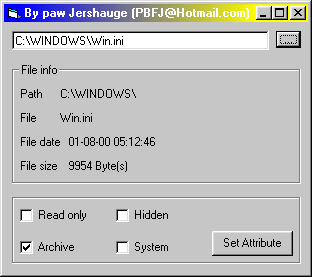



## Get file attributes

### Description

This shows how to get the files attributes or set the attribute for the file
 
### More Info
 
If you are not carefull you shuld lock som system file so there can't be used

             |
---                |---
**Submitted On**   |2000-08-01 15:57:36
**By**             |[Paw Jershauge](https://github.com/Planet-Source-Code/PSCIndex/blob/master/ByAuthor/paw-jershauge.md)
**Level**          |Intermediate
**User Rating**    |4.5 (18 globes from 4 users)
**Compatibility**  |VB 6\.0
**Category**       |[Files/ File Controls/ Input/ Output](https://github.com/Planet-Source-Code/PSCIndex/blob/master/ByCategory/files-file-controls-input-output__1-3.md)
**World**          |[Visual Basic](https://github.com/Planet-Source-Code/PSCIndex/blob/master/ByWorld/visual-basic.md)
**Archive File**   |[CODE\_UPLOAD8472812000\.zip](https://github.com/Planet-Source-Code/paw-jershauge-get-file-attributes__1-10287/archive/master.zip)

